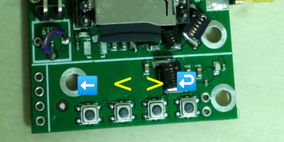

# qn8007_fm_tx
FM transmitter based on QN8007 with MP3 player and PA

* USB powered
* Uses DFPlayer MP3 player module (available from aliexpress)
* 1W PA using RQA0009
* Integrated output lowpass filter

### Building the software
* Download and build libopencm3 (https://github.com/libopencm3/libopencm3)
* Build:
```bash
cd qn8007_fm_tx/sw
export OPENCM3_DIR=/PATH/TO/LIBOPENCM3
make
```
* Download and build st-link software (https://github.com/texane/stlink)
* Flash device (using ST-Link, available from aliexpress)
```bash
cd qn8007_fm_tx/sw
rm st-flash
ln -s /PATH/TO/STLINK/build/Release/st-flash ./

./st-flash --reset --format ihex write binary.hex
# or 'make flash'
```

### MCU UI

* There is currently no GUI, but there is a UI consisting of the 4 buttons and one LED
* The 4 buttons correspond to return, <, >, and enter
* To change the frequency: press return and enter at the same time, and the LED will stay lit. Then < > adjusts frequency by 0.1MHz, and double clicking < or > adjusts by 1MHz. Press return to exit frequency adjust.
* In normal operation the LED blinks with a rate proportional to temperature. A continuously lit LED corresponds to the thermal shutdown temperature.
* In normal operation the code plays songs at random from the SD card, and double clicking the > button skips the current song.


### PCB stackup
* 4 layers
* FR4
* 1.5mm total thickness
* 0.2mm top/bottom prepreg thickness

### Top view


### Bottom view


---
To open schematics, it is necessary to add all gEDA symbols here to your symbol library: https://github.com/gabriel-tenma-white/sym

To edit PCB layouts, make sure "packages" is a symlink to a cloned repository of: https://github.com/gabriel-tenma-white/packages2
