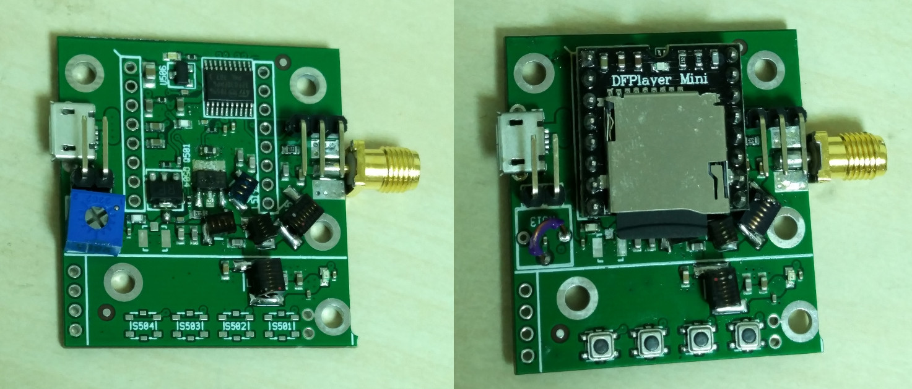
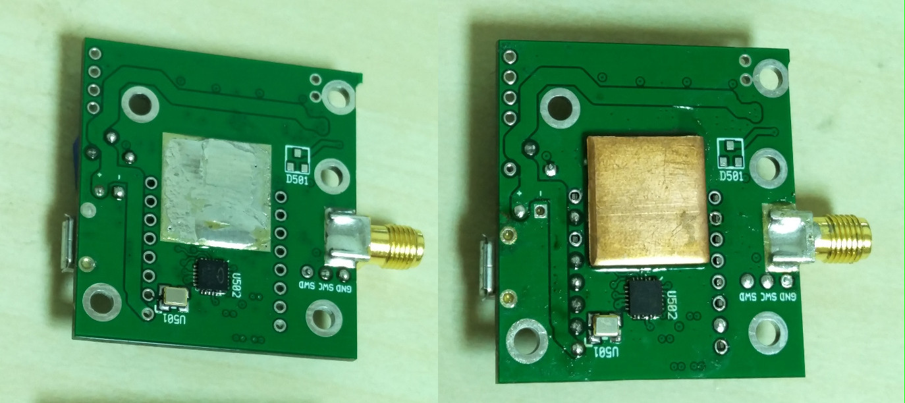

# qn8007_fm_tx
FM transmitter based on QN8007 with MP3 player and PA

* USB powered
* Uses DFPlayer MP3 player module (available from aliexpress)
* 1W PA using RQA0009
* Integrated output lowpass filter

### PCB stackup
* 4 layers
* FR4
* 1.5mm total thickness
* 0.2mm top/bottom prepreg thickness

### Top view

### Bottom view

